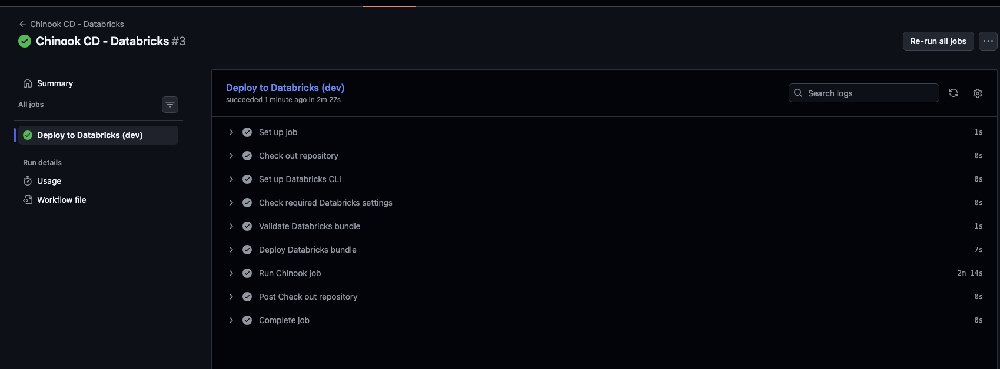

# Learning Journal - 2026-09-01 - CI/CD with Databricks

## What I worked on

I added CI/CD to our Chinook Data Warehouse project, `d3-chinook-dimensional-model`.

The CI workflow runs when changes are pushed or when a pull request is opened against `main`. It checks:

- Project structure
- Python syntax
- SQL files
- Raw-layer conventions

The CD workflow uses a Databricks Bundle to validate and deploy the project to Databricks. The job flow is organized as:

`Setup → Raw → Clean → Mart → Tests/Analytics`

The deployment to the Databricks `dev` target succeeded.

## What I learned

CI helps find errors before changes are merged. CD helps deploy a tested and version-controlled project consistently.

I learned that deploying a Databricks job is different from running the job. The initial deployment succeeded with `run_job: false). After running the workflow again, the `Run Chinook job` step also completed successfully.

The CD workflow requires Databricks connection settings such as:

- `DATABRICKS_HOST`
- `DATABRICKS_TOKEN`
- `DATABRICKS_SQL_WAREHOUSE_ID`

I also learned that environment variable names must match the Databricks Bundle configuration, such as using the `BUNDLE_VAR_` prefix for bundle variables.

## What confused me

At first, I thought a successful deployment meant that the whole data pipeline had already run. I learned that deployment makes the workflow available in Databricks, while running the job executes the actual pipeline.

## One small next step

- [ ] Review the Raw, Clean, Mart, and analytics outputs after the successful job run.
