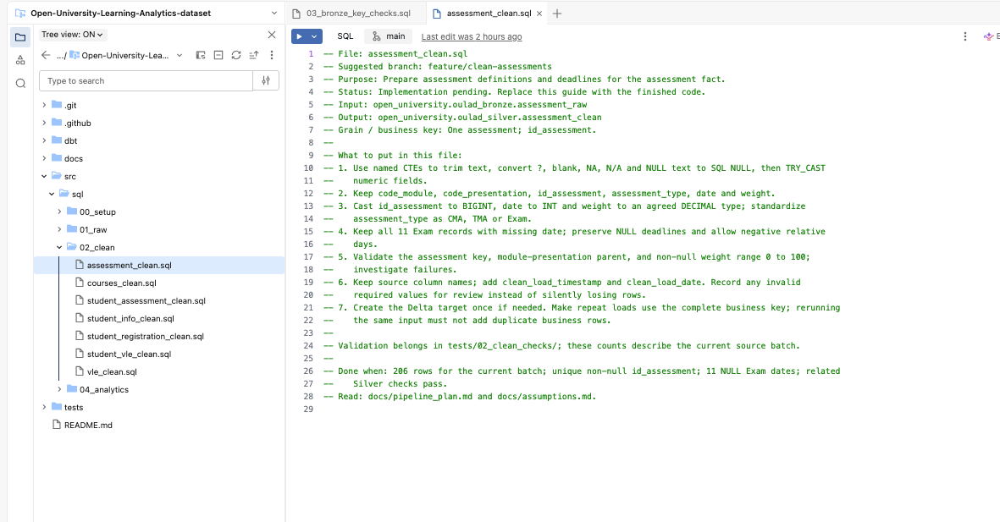
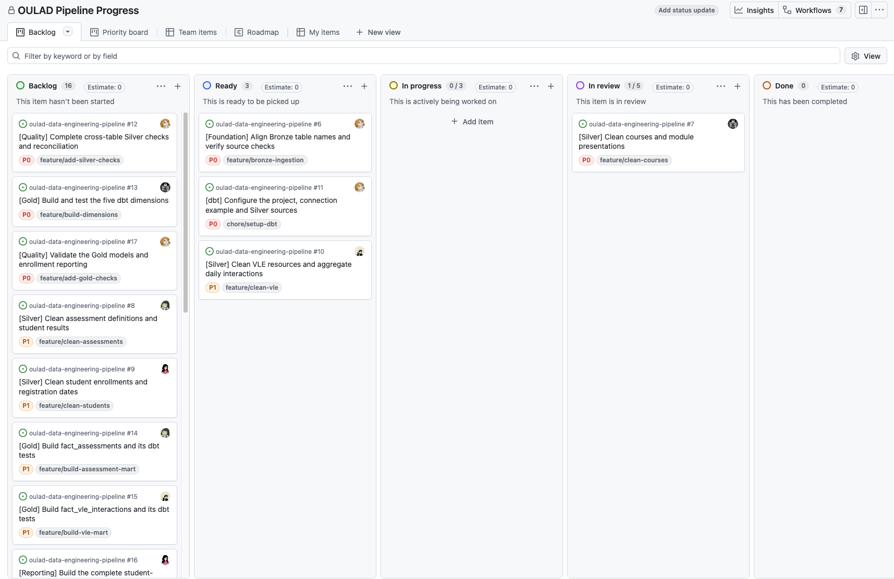

# Journal - 2026-09-08 - OULAD Setup and a New Team

## Today in one sentence

- I learned that a good data engineering project starts with clear data rules, clear tasks, and a team that feels safe enough to ask questions.

## What I learned

- Our OULAD pipeline follows this flow: **Source CSV → Bronze → Silver → Gold → Analytics**.
- Bronze preserves the original source records and adds `ingestion_timestamp` and `ingestion_date`.
- Creating a Delta table with `CREATE TABLE IF NOT EXISTS` is part of the initial setup, but it is not automatically an incremental-loading strategy.
- Missing values should not be replaced without understanding their meaning. The 173 missing TMA scores remain NULL, and the 11 unknown Exam dates should not be invented.
- Repeated VLE daily keys should be grouped using the complete business key and `SUM(sum_click)`. Keeping one arbitrary row could remove valid recorded clicks.
- Source findings belong in `source_assessment.md`, agreed treatments belong in `assumptions.md`, and implementation steps belong in `pipeline_plan.md`.
- Our professor-aligned Gold model contains five dimensions and exactly two facts: `fact_assessments` and `fact_vle_interactions`.
- File guides are useful because they tell the assigned member the purpose, input, output, grain, suggested branch, and definition of done.
- One task branch can contain the transformation, related tests, and documentation. Hindi kailangan ng separate branch for every file.
- GitHub Issues and the Project board make task ownership, priority, dependencies, and progress visible to the whole team.

## Terms I am still learning

- **grain** - what one row represents in a table
- **business key** - the field or combination of fields that identifies one business record
- **reconciliation** - checking that important counts and totals still match between pipeline layers
- **relative day** - a day counted before or after the module presentation start; day 0 is the start
- **dbt model** - a SQL transformation managed and tested through dbt
- **idempotent load** - a process that can be rerun without creating duplicate records or inflated totals

## What confused me

- At first, I mixed up source assessment, assumptions, and the pipeline plan because all three discuss the same data issues from different perspectives.
- I needed to understand why the 10,655,280 VLE source rows could become 8,459,320 daily rows without treating the difference as automatic data loss.
- I also needed to separate a prepared folder structure from a completed pipeline. Existing files and guides do not mean that all transformations have already been implemented and validated.

## One small next step

- [ ] Align the Bronze table names used by the loaders and source checks.
- [ ] Start the assigned Silver transformations using the documented rules.
- [ ] Record actual validation results before marking tasks complete.
- [ ] Continue encouraging my teammates to ask questions while we work.

## Git checkpoint

- [x] I created and organized the OULAD repository structure.
- [x] I added purpose and implementation guides to the assigned files.
- [x] I created GitHub Issues with owners, priorities, suggested branches, and completion checks.
- [x] I organized the tasks in a GitHub Project board.
- [x] I updated and pushed this journal entry.

## Evidence from today (optional)

### Project structure and file guidance

The screenshot shows our project structure in Databricks and the guide inside `assessment_clean.sql`. The guide explains what the future assignee should implement, including the expected grain, missing-value treatment, and validation requirements.

### GitHub task tracking

The Project board shows the saved status of our assigned work. May Backlog, Ready, In progress, In review, and Done columns, so the team can quickly see which tasks are waiting and which ones are already moving.

### A message from my new team

The people in this illustration are AI-generated, but the anonymized message is an actual message from one of my teammates.

## Reflection (optional)

- **What felt meaningful today?** The message from my teammate really stayed with me. Hindi ko akalain na kaya ko rin palang magturo and help others learn. Masyado ko lang palang dina-down ang sarili ko because I thought I did not have enough soft skills.

- **What did I realize about myself?** Maybe teaching is not about knowing everything. It can also mean explaining what I understand, admitting what I still need to learn, and making people feel comfortable enough to ask questions.

- **What do I appreciate?** I appreciate all their compliments, especially when they said they hoped to become like me when they lead someday. Gusto kong ma-witness iyon. I'm rooting for them and for the Data Engineers and leaders they will become. Naiyak ako nang konti, but for documentation purposes, allergies lang din ito. Hahaha.

- **How do I feel about the new team?** I still miss my previous group because nakapagpalagayan na kami ng loob and we already understood how each person worked. At the same time, I'm grateful that my new teammates wanted me in their group.

- **What surprised me?** Medyo formal pa kami at first, pero nung nag-usap kami, nalaman kong nahihiya lang din pala sila sa akin. Introverted ako, and introverted din daw sila. Ayon, isang group of introverts na naghihintayan lang kung sino ang unang magtatanong.

- **What do I want for us?** I want us to feel safe saying “hindi ko gets,” asking for help, and sharing ideas. I can miss my old team while still giving this new team the chance to become close.

## Mood or meme (optional)

- Today felt like: **“The dashboard gets the attention, while data infrastructure quietly keeps the whole project alive.”**

*The dashboard may look effortless, pero behind it, data infrastructure is doing the rescue mission.*

---

### Project references

- [OULAD Data Engineering Pipeline](https://github.com/ItsYangCoder/oulad-data-engineering-pipeline)
- [Pipeline plan](https://github.com/ItsYangCoder/oulad-data-engineering-pipeline/blob/main/docs/pipeline_plan.md)
- [Source profiling results](https://github.com/ItsYangCoder/oulad-data-engineering-pipeline/blob/main/docs/source_assessment.md)
- [Documented assumptions](https://github.com/ItsYangCoder/oulad-data-engineering-pipeline/blob/main/docs/assumptions.md)
- [Project issues](https://github.com/ItsYangCoder/oulad-data-engineering-pipeline/issues)

*Counts and task statuses refer to the recorded source batch and the saved project-board screenshot. Planned outputs still require implementation and validation.*
