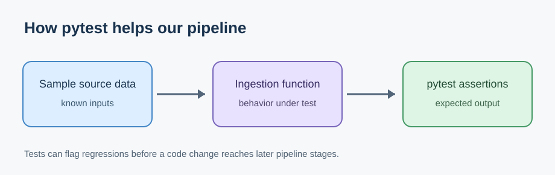

# Journal - 2026-09-23 - Explaining pytest in Our Data Pipeline

## Today in one sentence

- I practiced explaining why our team uses pytest and what a passing test actually tells us about our data pipeline.

## What I learned

- A pipeline has several steps: we collect source data, ingest it, check or transform it, and prepare it for analysis. A small mistake near the start can affect everything downstream.
- **pytest** runs checks written in Python. We give a function a known input and compare its result with what we expect. This is more repeatable than trying the same cases manually every time someone changes the code.
- A useful test can check a behavior such as rejecting an invalid input, handling a missing field, or producing the expected output for a small sample. The exact cases should come from what our code is supposed to do.
- A passing test means the behaviors covered by those tests passed in that run. It does not prove that every data file is correct, that a download endpoint is available, or that the full Databricks pipeline will succeed.
- When I present pytest, I can explain it using a simple story: “We feed a small, known example into part of the pipeline, run the same check automatically, and see whether the result still matches our expectation.”
- This is especially useful for our NYC Mobility work because ingestion and reruns should behave predictably. For example, we should be able to check the intended behavior when an input file is missing or a process is rerun, once those expectations are defined in our code and tests.

## Terms I am still learning

- **assertion** - a statement in a test describing the result I expect
- **test case** - one specific situation, including its input and expected outcome
- **regression** - an old behavior breaking after a new code change
- **idempotency** - rerunning a step without creating unwanted duplicates or changing a result unexpectedly
- **integration test** - a check involving multiple connected parts rather than one isolated function

## What confused me

- I initially wondered whether a green pytest result meant the entire pipeline and all real-world data were healthy. I now understand that it only covers the cases we actually tested.
- I still want to distinguish clearly which checks belong in Python tests and which belong in data quality checks on actual Bronze, Silver, or Gold tables.

## One small next step

- [ ] Pick one existing NYC Mobility test and prepare a classroom example with its input, expected output, actual result, and the problem it would catch.

## Git checkpoint

- [x] I created or updated a file.
- [x] I wrote a commit.
- [x] I pushed my changes.

## Decisions or assumptions (optional)

- This is a learning and presentation entry based on our conversation about pytest. I am not claiming that I added a new test to the NYC Mobility repository today.
- The diagram below is an illustration made for this entry, not a screenshot of a real test run.

## Evidence from today (optional)

The illustration helps me explain the idea in class: start with a known example, run the code, and compare the result with the behavior we expect.

- [NYC Mobility ingestion project](https://github.com/ItsYangCoder/nyc-mobility-ingestion-pipeline) — project context for our pipeline work.

## Reflection (optional)

- I sometimes understand a tool better after trying to explain it in plain language. For pytest, I can start with the reason we need it: code changes are easier to trust when we can rerun the same checks.
- I want to be careful with the phrase “our tests passed.” It sounds reassuring, but I should also be able to say **what** was tested and what still needs a real data or end-to-end check.

## Mood or meme (optional)

- Today's mood: trying to make a technical topic sound simple enough that I could explain it without reading straight from a slide.
