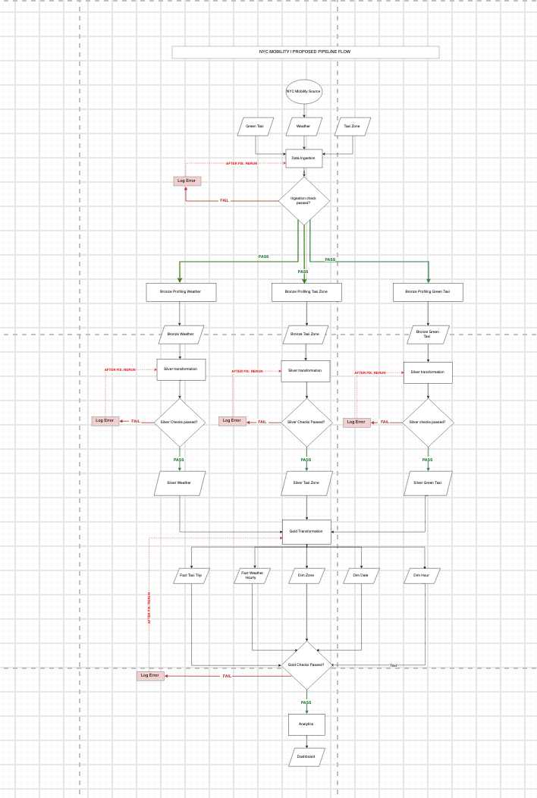

# Journal - 2026-09-24 - A Valid Deployment Is Not Yet a Correct Pipeline

## Today in one sentence
- I learned that Databricks can successfully validate and deploy a pipeline configuration even when the resulting dependency graph does not yet represent the complete quality-controlled flow I intended.

## What I learned
- I ran `databricks bundle validate -t development`, and the bundle returned **Validation OK**. I also planned the `pipelines.medallion_pipeline` resource for the development target. This confirmed that Databricks could understand the bundle configuration and identify the pipeline resource.
- The Databricks pipeline view later showed a **Completed — Validate-only** result. That is useful evidence that the pipeline definitions could be analyzed, but it is not evidence that all tables processed real data successfully. A validate-only run checks definitions and dependencies without performing the same work as a full refresh or production run.
- The generated graph showed three main dataset paths: Green Taxi, Taxi Zones, and Weather moving from source or volume paths into Bronze, Silver, and Gold outputs. However, some objects such as `dim_date` and `dim_hour` appeared disconnected, and the quality-control flow was not visually represented the way I expected.
- I realized that a Databricks pipeline graph is built from actual table-read dependencies in the code. It is not a manually arranged business-process diagram. If a Gold table does not explicitly read a dimension or Silver table, Databricks has no dependency edge to draw between them.
- My proposed flowchart and the Databricks graph serve different purposes. The flowchart can show control logic such as **check → pass → continue** and **fail → log error → rerun**. The Databricks graph mainly shows dataset lineage: which table reads from which upstream dataset.
- Data-quality checks do not always appear as separate boxes in a declarative pipeline. Expectations can be attached to a table and displayed as metrics or metadata. Separate validation nodes appear only when quality checks are implemented as their own tables, views, tasks, or quarantine flows.
- A production-ready design therefore needs two connected views:
  - **Data lineage:** source → Bronze → Silver → Gold → analytics.
  - **Operational control:** validation, expectations, failure handling, monitoring, and rerun behavior.
- The successful validation was still valuable. It narrowed the problem from "the bundle cannot deploy" to "the deployed definitions and dependencies need to better express the intended architecture."

## Terms I am still learning
- **DAG (Directed Acyclic Graph)** - a dependency map that shows which dataset or task must come before another, without creating circular dependencies.
- **Data lineage** - the trace of where data came from, how it changed, and which downstream tables use it.
- **Expectation** - a declarative data-quality rule attached to a pipeline dataset, such as requiring a key to be non-null.
- **Validate-only run** - a run that checks whether pipeline definitions are valid without doing the same data processing as a full execution.
- **Orchestration** - coordinating the order, dependencies, retries, and status of pipeline work.
- **Health monitoring** - observing whether pipeline runs, tables, freshness, and quality checks remain healthy over time.

## What confused me
- I expected the Databricks pipeline view to look exactly like the detailed process flowchart. I now understand that they should agree on the important dependencies, but they will not necessarily have the same visual structure.
- I was also unsure whether every quality check should be a visible node between Bronze, Silver, and Gold. The answer depends on implementation: table expectations may appear inside the table details, while dedicated validation tasks or quarantine tables can appear as separate nodes.
- The biggest open question is whether the current Gold definitions read every required Silver fact and dimension input explicitly. The disconnected date and hour dimensions suggest that I need to trace the code rather than judging only from the diagram.
- I still need a full pipeline run and data-quality results before I can say that the deployed pipeline is healthy. A green validation result proves configuration readiness, not data correctness.

## One small next step
- [ ] Trace the Green Taxi path end to end in the pipeline code and confirm one explicit dependency chain—raw source → Bronze → Silver → Gold—with a verified quality rule at each required layer.

## Git checkpoint
- [x] I created or updated a file
- [x] I wrote a commit
- [x] I pushed my changes

## Decisions or assumptions (optional)
- I will treat the Databricks graph as the source of truth for implemented dataset dependencies and the process flowchart as the source of truth for intended control logic.
- I will not add artificial tables only to make the graph look more detailed. A visible node should represent a real dataset, validation output, or executable task.
- I will keep quality expectations close to the tables they protect, and I will use separate monitoring or quarantine outputs only when they provide an operational benefit.
- I selected the clean flowchart screenshot for this entry. I did not publish the browser screenshot because it exposed a workspace URL, pipeline identifier, and personal workspace label that were unnecessary for the learning.

## Evidence from today (optional)
- Local Databricks CLI result: `databricks bundle validate -t development` returned **Validation OK** for the `nyc-mobility` development target.
- Databricks UI result: the pipeline completed a **Validate-only** run on September 24, 2026 and displayed the generated dataset dependency graph.
- Current project repository: [NYC Mobility Production](https://github.com/crisstin92-ui/nyc-mobility-production)
- Journal template followed: [entry-extended.md](https://github.com/ItsYangCoder/ftw-b12-journal/blob/main/templates/entry-extended.md)
- Proposed pipeline flow used for comparison:

The diagram makes the intended control flow visible: each stage has a pass path and a failure path, while the three source streams converge into the Gold and analytics layers.

## Reflection (optional)
- What felt easy today? Running the bundle validation and seeing Databricks recognize the pipeline resource gave me a clear technical checkpoint.
- What felt difficult today? The pipeline looked deployed, but the visual graph did not match the architecture in my head. That made me question whether the problem was the diagram, the code, or my understanding of how Databricks draws dependencies.
- What do I want to understand better next time? I want to read the pipeline definitions beside the generated graph and explain exactly which code reference creates each edge.
- The most useful realization was that "green" has a scope. A green validation result is good, but I still need execution evidence, quality metrics, and correct lineage before calling the whole pipeline healthy.

## Mood or meme (optional)
- Today was a very Data Engineering kind of lesson: the deployment can be green while the architecture still needs another honest look. 🟢🔍
