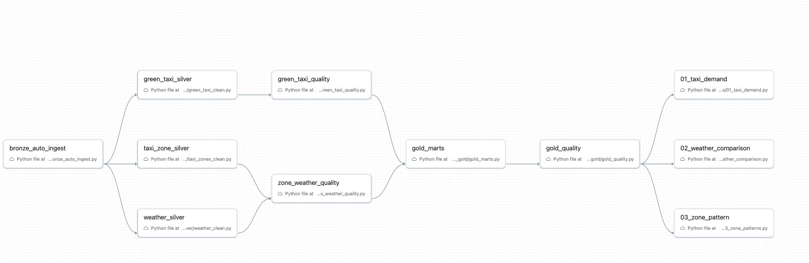

# Journal - 2026-09-25 - File-Based Jobs, Idempotency, and Quality Gates

## Today in one sentence
- I learned how to turn separate NYC Mobility Python files into one understandable Databricks job flow, while using reconciliation and idempotency checks to prove that the pipeline is doing more than simply moving data.

## What I learned
- A Databricks job can be designed file by file. Each Python file can represent one clear responsibility: ingestion, Bronze loading, Silver cleaning, quality validation, Gold modeling, or analytics. The important part is not whether the code is a notebook or a `.py` file; the important part is whether the task has the correct runtime, parameters, imports, and upstream dependencies.
- The high-level job flow now has a clear shape. `bronze_auto_ingest` starts the work, the three source streams separate into Green Taxi, Taxi Zones, and Weather processing, quality tasks block bad data before Gold, `gold_quality` validates the final model, and only then do the three analytics tasks run.
- I understood why quality checks belong inside the dependency chain. If `gold_marts` runs directly after a transformation without waiting for its quality task, the pipeline can publish technically valid tables that contain unacceptable data. A quality gate is useful only when downstream tasks cannot continue after it fails.
- The Green Taxi row counts gave me a concrete reconciliation example. Bronze contained **133,367 rows**, while Silver contained **133,355 rows**. The difference is **12 rows**: **11 rows outside the project period** and **1 row with reversed pickup and drop-off time**. This is much stronger evidence than saying that Silver has "fewer rows" because every excluded row has a known rule.
- The **4,592 zero-distance rows** were not automatically deleted. They were retained and flagged. I learned that an unusual value is not always invalid: a zero-distance trip may represent a cancelled ride, a recording issue, or a real event that still matters for trip counts. Flagging preserves evidence while allowing distance-based analytics to exclude those rows deliberately.
- The Silver check also reported **0 duplicate groups** and **0 extra rows**. These checks protect two different risks: duplicates can inflate measures, while extra rows can indicate an accidental many-to-many join or an incorrect transformation.
- Taxi Zones provided a simple dimension-quality example: **265 Silver rows and 265 unique location IDs**. This tells me that the intended grain—one row per taxi zone—is holding.
- Weather needs a different quality rule because its grain is one observation per local hour. The development branch now includes a reusable rule that checks the expected hourly count, distinct hours, first hour, and last hour for a source month. For March 2026, a complete non-DST-adjusted monthly file should contain **744 hourly observations**. Tests also cover missing and duplicate interior hours.
- Idempotency became easier to understand through the rerun result. Reprocessing the same already-recorded input produced **0 inserted rows**. This does not mean Bronze can never grow. It means the same input should not be inserted twice; a genuinely new file or changed source version can still add records.
- A visible DAG is helpful, but the job still needs execution evidence. Today’s screenshot proves that the tasks and dependencies were designed in the UI. It does not yet prove that every task completed successfully with the expected row counts.

## Terms I am still learning
- **Fan-out** - one upstream task starts several independent source-specific branches.
- **Fan-in** - several branches must finish before one downstream task can start.
- **Quality gate** - a validation task that stops downstream processing when required rules fail.
- **Idempotency** - rerunning the same input produces the same final state without adding duplicate data.
- **Reconciliation** - explaining the relationship between input and output counts, including every intentional exclusion.
- **Grain** - what exactly one row represents in a table.
- **Flagging** - retaining a record while adding a field that identifies a quality condition for later filtering.
- **Task dependency** - an enforced rule that one task can run only after its required upstream task succeeds.

## What confused me
- I was unsure whether Databricks Jobs required notebooks. They do not: a Python script can be a job task, but notebook widgets are not automatically available inside a normal Python file. A script should receive values through supported task parameters, arguments, configuration, or environment variables.
- I initially thought an idempotent rerun must always show the same total row count. The more precise rule is that the same input must not create another copy. The table can still grow when the pipeline discovers a new valid source file.
- I also had to separate invalid rows from analytically unusual rows. The reversed-time record violates the basic event sequence and can be excluded from clean Silver data. Zero-distance trips need more context, so retaining and flagging them is safer than silently deleting them.
- The high-level job graph combines some validation work into `green_taxi_quality`, `zone_weather_quality`, and `gold_quality`. I still need to verify which exact rule is owned by each task so that a failure message points to the correct source and layer.
- The remaining open question is whether all Python task imports and parameters will resolve under the Databricks job environment. A clean graph is a design checkpoint, not a successful end-to-end run.

## One small next step
- [ ] Run the complete development job once, rerun it without changing the input files, and record each task status plus the first-run and rerun inserted-row counts.

## Git checkpoint
- [x] I created or updated a file
- [x] I wrote a commit
- [x] I pushed my changes

## Decisions or assumptions (optional)
- I will keep source-specific transformations in separate files so failures are easier to locate and rerun.
- I will place source and Silver quality tasks before `gold_marts`, then require `gold_quality` to pass before any analytics task starts.
- I will treat out-of-period and reversed-time rows as explicit exclusions that must reconcile with the Bronze-to-Silver count difference.
- I will retain zero-distance trips with a quality flag, but distance averages and other distance-sensitive metrics should exclude flagged distance outliers deliberately.
- I will describe the current workflow screenshot as a designed job graph, not as proof of a successful full pipeline run.
- I selected a clean screenshot that contains only task names and dependencies. Screenshots exposing workspace URLs, job IDs, email addresses, and personal account labels were not used.

## Evidence from today (optional)
- Green Taxi notebook results: Bronze **133,367 rows**; Silver **133,355 rows**; **11** outside-period rows; **1** reversed-time row; **4,592** zero-distance rows; **0** duplicate groups; **0** extra rows.
- Taxi Zones result: **265 rows and 265 distinct location IDs**.
- Verified repository commit: [Refactor Bronze weather coverage into a tested rule](https://github.com/ItsYangCoder/nyc-mobility-data-pipeline/commit/9053247bfa2c48d7670081c6c4d6872060bdea49)
- Active project repository: [NYC Mobility Data Pipeline](https://github.com/ItsYangCoder/nyc-mobility-data-pipeline)
- Journal template followed: [entry-extended.md](https://github.com/ItsYangCoder/ftw-b12-journal/blob/main/templates/entry-extended.md)

The screenshot captures the high-level orchestration design: source branches fan out, quality results fan in before Gold, and analytics wait for the final Gold quality gate.

## Reflection (optional)
- What felt easy today? The pipeline became easier to reason about when each file had one responsibility and each arrow had a clear meaning.
- What felt difficult today? The difficult part was deciding which records should be rejected, which should be flagged, and how every decision should appear in row-count reconciliation.
- What do I want to understand better next time? I want to see one complete Databricks job run and connect every task result to its table, quality rule, and row-count evidence.
- Today’s progress reminded me that a clean pipeline is not only a neat folder structure or a good-looking DAG. It is a system where reruns are safe, exclusions are explainable, failures stop the correct downstream work, and the final analytics use data whose quality has been checked.

## Mood or meme (optional)
- The DAG finally looks calmer than the debugging process that created it. 🧩✅
