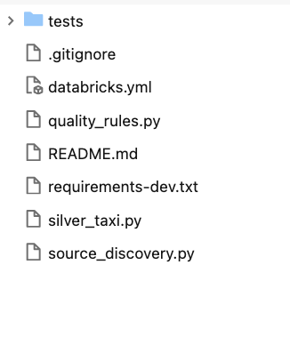

# Journal - 2026-09-26 - Python Job Runtime Contracts

Use this version only if you want more structure. The basic `entry.md` is enough for most days.

## Today in one sentence
- A Databricks Job graph can show the correct task order and still fail when a Python file starts, because the graph does not guarantee that imports, arguments, paths, compute, and permissions match what the script expects.

## What I learned
- I reviewed the current NYC Mobility Python-job structure instead of claiming a new September 26 implementation result. The latest verified repository evidence still says that the complete Job has not been validated end to end in a fresh Databricks workspace. That makes runtime readiness the honest learning topic.
- A workflow graph describes **orchestration**: which task runs first, which tasks may run in parallel, and which downstream tasks wait for quality gates. It does not prove **runtime compatibility**. Runtime compatibility means that the selected Python file can actually start on the configured compute with every required module, parameter, path, catalog, schema, and permission available.
- The current Silver script makes this boundary concrete. `silver_taxi.py` imports `month_window` from `quality_rules.py`, accepts five required command-line arguments, creates or replaces a view, and then queries that view. The scheduler must therefore satisfy several contracts before the transformation logic is even tested:
  1. `quality_rules.py` must be importable from the process's Python module search path.
  2. Task parameters must use the exact flags `--start-month`, `--end-month`, `--catalog`, `--bronze-schema`, and `--silver-schema`.
  3. The selected identity must be allowed to read Bronze and create or replace objects in Silver.
  4. The job compute must provide a working Spark session and the expected Databricks runtime.
- Python resolves `from quality_rules import month_window` through `sys.path`, not by looking at the visual Job graph. If the Job launches a nested file while the shared module remains somewhere else in the Git folder, an import can fail before Spark SQL runs. The screenshot below is useful because it shows the shared modules beside the entry script; the next check is whether Databricks launches that structure with the same import root that local tests use.
- Parameters are also part of the interface. `argparse` treats a missing required option as a startup error, while a misspelled flag becomes an unknown argument. A bundle can validate as YAML even when the values passed to the script do not satisfy its parser.
- Local tests and `compileall` are valuable but answer narrower questions. They can prove that pure-Python rules and syntax behave locally; they cannot prove that a fresh workspace has the source Volumes, Unity Catalog permissions, task values, and runtime paths required by the whole Job.
- The practical debugging order I want to use is: identify the first failing task, capture the exact exception, classify it as import/parameter/path/permission/data/SQL, run only that task with the same compute and parameters, and then rerun downstream tasks only after the earliest contract is satisfied. This avoids changing transformation logic when the real problem is environment setup.

## Terms I am still learning
- **Runtime contract** - the conditions a script expects when it starts, including available modules, parameters, files, Spark, catalogs, schemas, and permissions.
- **Module search path (`sys.path`)** - the ordered locations Python checks when resolving an `import`.
- **Entry point** - the file or function the Job directly starts; here, `main()` parses arguments and creates the Spark session.
- **Orchestration dependency** - a rule that controls task order, such as allowing Gold to run only after Silver quality succeeds.
- **Execution identity** - the user or service principal whose permissions are used when the Job accesses workspace and data objects.
- **Half-open interval** - a range that includes its start and excludes its end. `month_window` returns this form so SQL can use `>= start` and `< next_month` without an end-of-day timestamp trick.

## What confused me
- The visual graph can look complete even when the runtime still cannot resolve a shared module. My open question is exactly what working directory and `sys.path` Databricks uses for each configured Python file task in this Git-folder layout.
- I also need the exact exception from the reported errored run before deciding whether the failure came from imports, missing task parameters, inaccessible Volume paths, permissions, or transformation logic. Without that message, choosing a fix would be guessing.
- The repository has both root-level shared files in the screenshot and a later numbered `pipeline/` layout in the branch documentation. I need to confirm that every Job task points to the same revision and layout before comparing a local test result with a Databricks run.

## One small next step
- [ ] Capture the first failed task's complete error and rerun only that task with the same compute and arguments; record whether the failure occurs before or after `SparkSession.builder.getOrCreate()`.

## Git checkpoint
- [x] I created or updated a file
- [x] I wrote a commit
- [x] I pushed my changes

## Decisions or assumptions (optional)
- I treated the lack of a verified September 26 pipeline change as a reason to write a concept-based reflection, not as evidence that the Job was fixed or completed.
- I did not claim an exact root cause because the accessible context reports an errored run but does not include the exception text.
- I used a safe screenshot shared on September 25 that contains only relevant repository filenames. It shows no credentials, tokens, personal paths, workspace URLs, or private identifiers.
- I kept the Job's current unverified status explicit: a valid configuration or clean graph is not proof of a successful end-to-end run.

## Evidence from today (optional)
- [Current `silver_taxi.py` entry script](https://github.com/ItsYangCoder/nyc-mobility-data-pipeline/blob/refactor/silver-taxi-python-script/silver_taxi.py) - imports `month_window`, requires five CLI arguments, starts Spark, and builds the Silver view.
- [Shared `quality_rules.py` module](https://github.com/ItsYangCoder/nyc-mobility-data-pipeline/blob/refactor/silver-taxi-python-script/quality_rules.py) - contains the month parsing and half-open window logic used by the script.
- [Workflow documentation commit](https://github.com/ItsYangCoder/nyc-mobility-data-pipeline/commit/0c95b6e1548123542a6c356cc141b317c895a2a5) - distinguishes bundle validation/deployment from actually running Databricks tasks.
- [Current-status commit](https://github.com/ItsYangCoder/nyc-mobility-data-pipeline/commit/9759813322d2b29dcc78d917007dad5073ac0831) - explicitly states that the complete Job has not yet been validated end to end in a fresh workspace.
- Screenshot source: a repository-tree image I shared on September 25, copied into this journal as `assets/2026-09-26-python-runtime-contract.png`.

## Reflection (optional)
- What felt easy today? Separating what the repository proves from what it does not prove: the code and task structure are visible, but a successful full run is not.
- What felt difficult today? The failure can happen at several boundaries before business logic begins, and the exact error text is the evidence needed to narrow those boundaries.
- What do I want to understand better next time? I want to trace one Python file task from its configured path and parameters through Python import resolution, Spark startup, catalog access, and the first SQL statement. That trace would turn a vague "Job error" into one testable contract at a time.

## Mood or meme (optional)
- 
- The picture is simple, but it captures the main lesson: files that look adjacent in a repository still need a correctly configured runtime import path. 🧩
