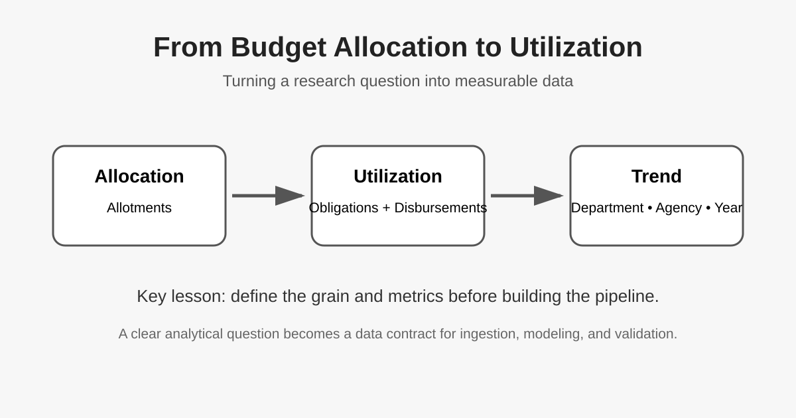

# Journal - 2026-09-27 - Turning a Budget Question into Measurable Data

## Today in one sentence
- Today I learned that before building a pipeline, I need to make sure the research question can actually be translated into fields, metrics, and a clear data grain.

## What I learned
- I worked on clarifying our Philippine government budget research question: **How are government budgets allocated and utilized across departments and agencies, and how have these patterns changed over time?**
- The biggest learning for me was that a good research question is not only something that sounds interesting. It has to map to data that we can actually measure. For this topic, allocation can be represented by **allotments**, while utilization can be examined through **obligations** and **disbursements**.
- I also learned why the **grain** matters early. If we want to compare departments, agencies, and fiscal years, those dimensions need to be represented consistently in the dataset. Otherwise, we may build a technically working pipeline that cannot answer the question correctly.
- This feels very similar to designing a Gold layer in a Data Engineering project. Before creating facts and dimensions, I need to know the business question, the measures, and the level of detail expected in each row.
- Another important lesson was separating **data availability** from **analytical feasibility**. Finding a government dataset is only the first step. We still need to inspect its coverage, field definitions, year consistency, and whether allocation and actual spending measures can be compared without making misleading assumptions.
- For our group meeting, the useful engineering questions are now clearer: What is our time scope? What is the row grain? Which fields are our measures? What calculations are valid? What data-quality checks will we need before we trust the results?

## Terms I am still learning
- **Allotment** - the amount of budget authority made available for an agency to incur obligations.
- **Obligation** - a commitment by the government to pay for goods, services, projects, or other valid expenses.
- **Disbursement** - the actual payment of government funds after an obligation is incurred.
- **Utilization rate** - a ratio used to show how much of an available budget amount has been obligated or disbursed, depending on the definition being used.
- **Data grain** - what one row represents. For our project, we still need to agree on the exact combination of year, department, agency, and any other breakdowns.

## What confused me
- At first, “allocation vs. actual expenditure” sounded straightforward, but I realized that government financial data has several stages. Allotments, obligations, and disbursements are related, but they are not interchangeable.
- I also need to be careful with the word **actual**. Before we use it in our final business question or dashboard, we should define whether we mean obligations, disbursements, or another officially reported measure.

## One small next step
- [ ] During the group meeting, finalize the dataset scope, fiscal years, grain, measures, utilization formula, and the exact claims we want the dashboard to support before meeting Kevin on Monday.

## Git checkpoint
- [x] I created or updated a file
- [x] I wrote a commit
- [x] I pushed my changes

## Decisions or assumptions (optional)
- We should not treat “budget allocated” and “money actually paid” as the same concept.
- The research question should drive the schema and pipeline design, not the other way around.
- Any utilization metric we publish needs an explicit numerator and denominator so that someone else can reproduce it.

## Evidence from today (optional)
- Today’s working discussion focused on converting the budget question into measurable fields: allotments, obligations, disbursements, fiscal year, department, and agency.
- We also prepared a group-meeting agenda so the team can settle the scope and analytical definitions before the mentor meeting.

*This diagram summarizes the mental model I used today: start from allocation, define how utilization will be measured, then compare the results at a consistent department/agency/year grain.*

## Reflection (optional)
- **What felt easy today?** Once the measures were named, the research question became much easier to reason about.
- **What felt difficult today?** The hardest part was realizing that familiar words like “budget,” “spent,” and “actual” can have specific meanings in public financial data. A vague definition could lead to a wrong metric even if the SQL is correct.
- **What do I want to understand better next time?** I want to understand the government expenditure lifecycle better and learn how to model the source data so our transformations remain traceable from raw records to dashboard metrics.

## Mood or meme (optional)
- Today felt less like writing code and more like designing the contract that the future code has to follow. That is still Data Engineering: getting the meaning right before automating the movement of data.
