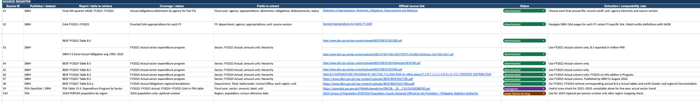

# Journal - 2026-09-28 - Aligning Source Vintages with Fiscal Years

## Today in one sentence
- Today I learned that collecting five years of government budget data is not just a download task: I must separate the document edition, the fiscal year in each column, and the meaning of each amount before combining anything.

## What I learned
- I worked on the source register for our Philippine government budget and spending project. The register now records the publisher, report or table, coverage, fields to extract, official link, download status, and a comparability note. This is useful because the project pulls related measures from several DBM and PSA publications rather than one clean five-year table.
- The most important lesson was that **publication year is not automatically the observation year**. For example, the official DBM BESF FY2023 page was published on August 22, 2022 and lists tables covering FY2021-FY2023. A table can therefore contain an older actual value, a current program value, and a future proposed value in the same edition.
- For the sector trend, my current extraction plan uses the `Actual` column from successive BESF Table B.5 editions: the FY2023 edition for FY2021 actual, FY2024 for FY2022 actual, FY2025 for FY2023 actual, FY2026 for FY2024 actual, and FY2027 for FY2025 actual. This mapping is a working source contract that still needs row-level verification before transformation.
- This explains why downloading only one B.5 file cannot produce a trustworthy 2021-2025 actual series. The file may display several fiscal years, but those columns can represent different statuses such as actual, program, or proposed. Treating all displayed years as final actual expenditure would mix unlike measures.
- The source register also separates different analytical measures. GAA files represent enacted appropriations, SAOB reports contain allotment and obligation information, and BESF sector tables support sector-level expenditure analysis. These sources can support related questions, but I should not join their amounts under one generic `budget` column without a clear semantic mapping.
- A practical Bronze design would preserve the source exactly and add metadata such as `source_document`, `source_edition_fy`, `observation_fy`, `measure_status`, `unit`, `source_url`, and `retrieved_at`. Silver can then standardize sector names, units, and year fields. Gold should expose only measures that have passed the comparability rules.
- I also learned why a source register is part of engineering, not just research paperwork. It becomes a compact data contract: it records where each dataset came from, which years it can answer, which fields matter, and what must be checked before ingestion.
- The biggest quality risk is a dataset that is technically readable but semantically inconsistent. A pipeline can load every PDF or spreadsheet successfully and still produce the wrong trend if one row uses appropriations, another uses obligations, and another uses proposed expenditure.

## Terms I am still learning
- **Source vintage** - the specific edition or release of a dataset or report, such as BESF FY2023.
- **Observation year** - the fiscal year that a value actually describes, which can differ from the report's edition year.
- **Measure status** - whether an amount is actual, programmed, proposed, appropriated, allotted, obligated, or disbursed.
- **Provenance** - the traceable record of where a value came from and how it entered the pipeline.
- **Semantic drift** - a change in a field's definition or meaning across years even when its label looks similar.
- **Schema harmonization** - converting different yearly layouts and labels into one consistent structure without losing their original meaning.

## What confused me
- A page titled BESF FY2023 contains tables labeled FY2021-FY2023, so the title alone does not tell me which column is the historical actual. I need to inspect the column headers and footnotes inside every edition.
- Table identifiers such as B.5 can stay the same while the years and column meanings move forward. I am still checking whether sector labels, hierarchy, units, and totals remain comparable across all five editions.
- The word `actual` is still too broad unless I attach the measure. Actual sector expenditure, actual obligation, and actual cash disbursement are not automatically interchangeable.
- Regional data introduces another grain problem. A national sector total and a department-region allocation cannot be joined as if they represent the same row-level entity.

## One small next step
- [ ] Build a five-row validation sheet for FY2021-FY2025 with `source_edition_fy`, `observation_fy`, exact column header, measure status, unit, and one reconciled total before writing ingestion code.

## Git checkpoint
- [x] I created or updated a file
- [x] I wrote a commit
- [x] I pushed my changes

## Decisions or assumptions (optional)
- I will keep the source edition year and observation fiscal year as separate fields.
- I will not combine appropriations, allotments, obligations, and disbursements into one measure.
- I will preserve the original unit from each source and perform unit conversion only in a documented transformation.
- I will treat the current FY2021-FY2025 mapping as an extraction plan, not as a validated result, until the headers and totals are checked in every source file.
- No new September 28 implementation commit was visible in my Data Engineering repositories, so this entry documents verified source-design work instead of claiming that an ingestion pipeline was built today.

## Evidence from today (optional)
- [DBM Budget of Expenditures and Sources of Financing FY2023](https://www.dbm.gov.ph/index.php/2023/budget-of-expenditures-and-sources-of-financing-fy-2023) - the official page is dated August 22, 2022 and lists the FY2021-FY2023 expenditure tables, including B.5 sector data and B.6 regional allocation data.
- [Yesterday's journal on defining allocation and utilization](https://github.com/ItsYangCoder/ftw-b12-journal/blob/main/journal/2026-09-27-budget-allocation-utilization.md) - the source-vintage work is the next step after defining the analytical measures.
- The source-register screenshot below records the selected DBM/PSA sources, coverage, expected fields, official links, status, and comparability notes.

*I used this screenshot because it shows the actual source-planning work without exposing credentials, private links, personal names, or local file paths.*

## Reflection (optional)
- **What felt easy today?** Once the sources were placed in one register, the missing years and incompatible measures became much easier to see.
- **What felt difficult today?** The filenames and table titles look consistent enough to encourage a quick merge, but the meaning of each year and amount still has to be verified inside the source.
- **What do I want to understand better next time?** I want to learn how DBM defines actual, program, proposed, appropriation, allotment, obligation, and disbursement across its publications, then convert those definitions into automated validation rules.

## Mood or meme (optional)
- Downloaded does not mean comparable. The real work begins when I can explain exactly what every row and amount represents. 🧾
