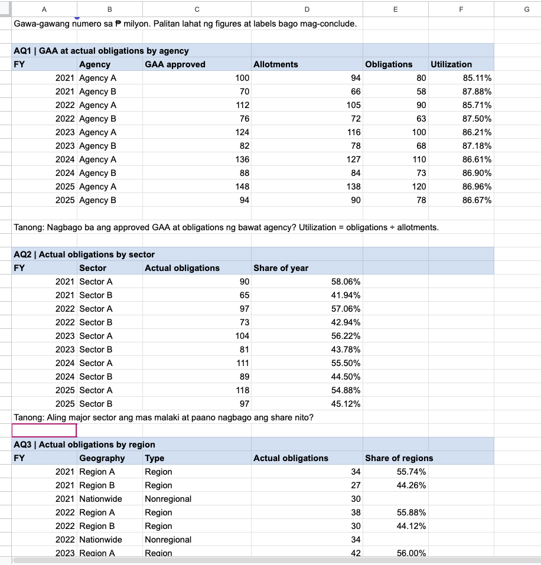

# From Prototype Values to Traceable Budget Metrics

## Today in one sentence

I learned that a spreadsheet can prove that a model works without proving that its numbers are true, so the path from a prototype to an analysis must preserve definitions, units, grain, and source lineage.

## What I learned

The budget workbook I reviewed contains deliberately fabricated values for agencies, sectors, and regions. That makes it useful as a **prototype**: I can test whether the layout, formulas, and charts behave as intended before spending time on source extraction. It is not yet evidence about Philippine government spending.

The clearest example is the utilization formula in the prototype:

```text
obligation utilization rate = obligations / allotments
```

This denominator matters. An **appropriation** is the spending authority approved in the General Appropriations Act (GAA). An **allotment** is authority released to an agency so it can incur obligations. An **obligation** is a commitment to pay for goods, services, projects, or other valid purposes. A **disbursement** is the actual payment of an obligation. These are stages in a budget process, not interchangeable names for the same amount.

Because obligations are incurred against available allotments, `obligations / allotments` answers: “How much of the released authority has been committed?” If I divide obligations by GAA appropriations instead, I am asking a different question: “How much of the enacted appropriation has reached the obligation stage?” Both ratios can be useful, but they need different names and cannot be compared casually. DBM also uses obligation rates as an indicator of agencies’ capacity to use available funds, which reinforces the need to state the exact denominator.

Replacing the sample numbers with official data is therefore more than copying values into cells. For every observation, I need to retain:

- fiscal year and reporting cutoff;
- agency, sector, or region definition;
- measure type: appropriation, allotment, obligation, or disbursement;
- exact unit, because a table may report pesos, thousands, or millions;
- source report, table, edition, and URL;
- whether the value is enacted, released, obligated, disbursed, preliminary, or final.

The row grain also needs to be explicit. For the agency analysis, a useful candidate grain is one row per `fiscal_year + agency + measure_type + reporting_cutoff`. Before joining GAA and SAOB values, I need to check that the agency names and coverage match. A successful join is not automatically a valid comparison if one source uses a department total while another uses an operating unit or a different reporting period.

I would also validate the replacement with simple controls: no duplicate keys at the declared grain, no missing denominators, no zero denominators, consistent units before arithmetic, and a source link for every imported figure. A utilization rate over 100% should be flagged for investigation rather than silently deleted; it could indicate a definition mismatch, an adjusted allotment, a timing difference, or a genuine source value.



*This inspected screenshot is the workbook prototype. Its warning says the figures are fabricated and must be replaced before drawing conclusions, so I am using it as evidence of the planned model—not as a government budget result.*

## Terms I am still learning

- **Prototype data** — invented or simplified values used to test a structure, formula, or visualization.
- **Data lineage** — the recorded path from an original source through extraction and transformation to a reported result.
- **Grain** — what one row represents and which fields make that row unique.
- **Allotment** — spending authority released to an agency so it can incur obligations.
- **Obligation rate** — obligations divided by the explicitly chosen base, commonly allotments when measuring use of released authority.
- **Reporting cutoff** — the date or period through which cumulative figures are measured.

## What confused me

My main confusion was why utilization used obligations divided by allotments instead of obligations divided by the GAA amount. The answer is that “utilization” is incomplete unless the denominator is named. The prototype is measuring use of released authority, while a GAA-based ratio would measure progress against enacted authority.

I still need to confirm how the official SAOB and BESF tables define agency coverage and whether annual values are final year-end amounts or cumulative values at a particular cutoff. I also need to verify the unit printed in each source table instead of assuming that every workbook uses millions of pesos.

## One small next step

Replace one prototype agency-year row with exact values from its official GAA and SAOB tables, record the source URL, table title, unit, edition, and reporting cutoff beside the values, then manually recompute the obligation rate before scaling the process to all agencies and years.

## Git checkpoint

- [x] Checked the journal directory for an existing 2026-09-29 entry before creating this one.
- [x] Inspected the selected screenshot and excluded images containing personal details.
- [x] Added the journal entry and its image as a single update to `main`.
- [ ] Replaced the workbook’s fabricated values with verified official figures.

## Decisions or assumptions (optional)

- Keep the prototype screenshot because its sample-data warning is visible and relevant to the lesson.
- Treat its agencies and numeric values as placeholders only.
- Use `obligations / allotments` only when the metric is labeled as an obligation utilization rate against released authority.
- Do not combine values until agency scope, fiscal year, reporting cutoff, and unit are aligned.
- Do not claim that official figures have been loaded; the accessible evidence only shows the prototype and the plan to replace it.

## Evidence from today (optional)

- [DBM Statement of Appropriations, Allotments, Obligations, Disbursements and Balances](https://www.dbm.gov.ph/index.php/statement-of-appropriations-allotments-obligations-disbursements-and-balances)
- [DBM explanation of quarterly budget-utilization reporting and obligation rates](https://www.dbm.gov.ph/index.php/management-2/2937-pangandaman-national-government-agencies-required-to-submit-quarterly-budget-utilization-reports)
- [Previous journal: Source Vintage Alignment](https://github.com/ItsYangCoder/ftw-b12-journal/blob/main/journal/2026-09-28-source-vintage-alignment.md)
- The inspected workbook screenshot embedded above, with an explicit warning that its numbers are fabricated.

## Reflection (optional)

A polished table can feel authoritative even when every value is temporary. The warning on the prototype is a useful discipline: presentation quality does not turn sample data into evidence. I would rather publish one traceable agency-year calculation with a clear definition than a complete-looking dashboard whose figures cannot be reproduced.

## Mood or meme (optional)

**Today’s rule:** a clean chart is not a source citation.
