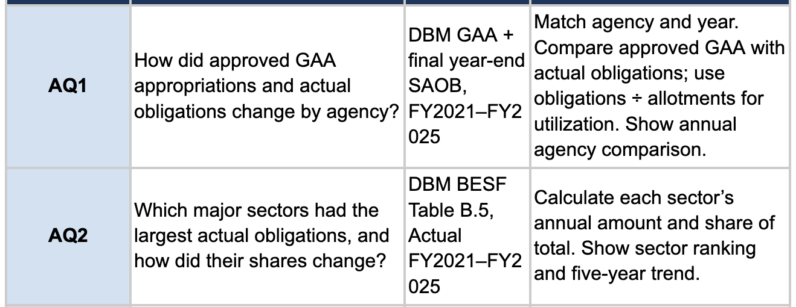

# Journal - 2026-10-03 - Not Every Number Is Additive

## Today in one sentence
- With no new Data Engineering commit today, I used the current PondoLens data contracts to understand why a valid numeric row is not automatically a row that can be added to every other numeric row.

## What I learned
- Long format makes data easier to filter, validate, and model, but it does not make every value additive. The PondoLens run produced **1,489,811 long-form rows** from nine source files and passed **55,393 reconciliation checks** with zero duplicate keys at the implemented grains. Those are important quality results, but the recorded validation explicitly warns that the rows are not all independent or safe to sum together.
- The main question before writing `SUM(value)` should be: **What does one row represent?** That is the grain. A row might represent one GAA budget line, a department summary, a regional detail, a workbook control total, a population projection, a growth interval, or a per-capita GRDP measure. The column is numeric in all of these cases, but the meanings and aggregation rules are different.
- The current pipeline keeps **1,077,957 approved budget lines** and also keeps **2 GAA workbook control totals**. The controls are useful because they let the pipeline reconcile the detail-line sum with the publisher's final total. They must not be included in the same business aggregation, or the total would be counted twice. A control row is evidence about the data, not another budget allocation.
- The same danger appears in agency data. The output contains **4,338 agency summaries** and **236,830 agency detail-hierarchy candidates**. If I sum the summary level together with its children, I may double count the same amount. The pipeline therefore requires a selected reporting level and expense class, and it excludes unresolved hierarchy candidates from analytical views.
- Regional tables have a similar rule: detail regions can be summed, but rows labeled as group totals, regional totals, or grand totals must be excluded when their component rows are already included. A `TOTAL` label is not a harmless description; it changes how the row can be aggregated.
- Some measures are not additive at all. A population growth rate cannot be added to a population count. Per-capita GRDP cannot be summed across regions to produce national GRDP. A percentage share also cannot be added across years. These measures need a different calculation at the target grain, usually from their underlying numerator and denominator.
- I learned a practical classification:
  - **Additive measures** can be summed across all intended dimensions when the grain and scope match, such as properly filtered budget-line amounts.
  - **Semi-additive measures** can be summed across some dimensions but not others. A balance can often be summed across departments at one date, but not across dates.
  - **Non-additive measures** should not be summed, such as rates, percentages, averages, and per-capita values.
- The shared long-form fields already support this discipline. `measure` says what the number means, `record_level` identifies its hierarchy, `unit` prevents mixing PHP, thousand PHP, counts, and rates, `value_status` preserves states such as undefined or source errors, and `analytical_eligible` separates usable observations from retained evidence or candidates.
- A safe Gold metric therefore needs more than a table name. It needs a metric contract: source view, row grain, required filters, measure, unit, aggregation function, excluded record levels, and a reconciliation rule. This is how a business question becomes an executable data rule instead of an informal instruction.

## Terms I am still learning
- **Grain** - the exact real-world thing represented by one row, including its dimensions such as year, agency, fund, measure, and reporting level.
- **Additive measure** - a value that can be summed across the intended dimensions without changing its meaning.
- **Semi-additive measure** - a value that can be summed across some dimensions but not all of them, often not across time.
- **Non-additive measure** - a value such as a rate, percentage, average, or per-capita figure that should be recalculated rather than summed.
- **Control total** - a publisher-provided or derived total used to check detail rows, not a new detail observation for the final aggregation.
- **Metric contract** - the written definition of a KPI's source, grain, filters, unit, calculation, and validation rule.

## What confused me
- A row can pass parsing, business-key, and reconciliation checks and still be excluded from an analytical total. At first this sounds inconsistent, but the checks answer whether the row was preserved and interpreted correctly; the aggregation rule answers whether it belongs in a specific calculation.
- The word `TOTAL` is not enough by itself. I still need to know whether it is the only published observation at that grain, a control for child rows, or a parent that overlaps with details. The hierarchy and intended question decide whether it should be selected or excluded.
- I also need to be careful with “actual spending.” Approved appropriations, available appropriations, allotments, obligations, and cash expenditure are different measures. Even when all values are PHP, they cannot be merged into one generic amount column and summed as if they describe the same event.
- The remaining modeling question is where to enforce these rules. Narrow Silver views make safe row sets reusable, while Gold models make each business metric explicit. I think both layers are useful: Silver for trustworthy observations and Gold for question-specific aggregation.

## One small next step
- [ ] Draft one metric contract for AQ1's annual agency comparison, including the exact numerator, denominator, source views, grain, unit, filters, excluded totals, and one reconciliation check.

## Git checkpoint
- [x] I created or updated a file
- [x] I wrote a commit
- [x] I pushed my changes

## Decisions or assumptions (optional)
- I will not use `SUM(value)` on a mixed long-form table without filtering by measure, unit, reporting level, analytical eligibility, and the required business grain.
- I will keep publisher totals as reconciliation evidence when detail rows already represent the analytical amount.
- I will calculate ratios and shares from approved numerators and denominators at the target grain rather than summing precomputed percentages.
- I will treat the current source PASS status as evidence that implemented source checks passed, not as permission to combine every retained row.
- No new relevant image was accessible today, so I reused an existing safe source-and-grain screenshot after inspecting it.

## Evidence from today (optional)
- [PondoLens data contracts and ingestion rules](https://github.com/ItsYangCoder/ph-government-budget-analysis/blob/dev/docs/long_form.md) - defines the analytical rules for agency, GAA, sector, regional, population, and GRDP rows.
- [Recorded source and long-form validation](https://github.com/ItsYangCoder/ph-government-budget-analysis/blob/dev/docs/evidence/long_form_validation.md) - records the row categories, reconciliation results, GAA control totals, retained candidates, and test limits.
- [PondoLens project status](https://github.com/ItsYangCoder/ph-government-budget-analysis/blob/dev/README.md) - distinguishes implemented source ingestion from pending cross-source mapping and analytical layers.
- [AQ1/AQ2 source-and-grain map](https://github.com/ItsYangCoder/ftw-b12-journal/blob/main/assets/2026-09-30-question-source-grain-map.png) - shows the real analytical questions, source families, and intended comparison methods.

## Reflection (optional)
- The main lesson for me is that clean-looking numeric data can still produce the wrong answer if I ignore grain. A pipeline can preserve every source cell perfectly and still double count when the model mixes details, summaries, and controls.
- This makes data modeling feel less like arranging tables and more like protecting meaning. The strongest quality gate is sometimes not “Is this numeric?” but “Is this number allowed in this calculation?”
- I want future dashboards to be simple for the viewer because the difficult decisions are already explicit in the model. If a chart shows an annual agency total or utilization rate, its grain, scope, and formula should be traceable without guessing.

## Mood or meme (optional)

This inspected screenshot is relevant because it connects each analytical question to a source and calculation method. It is a reminder that the question determines the grain and aggregation rule before the dashboard is built.
