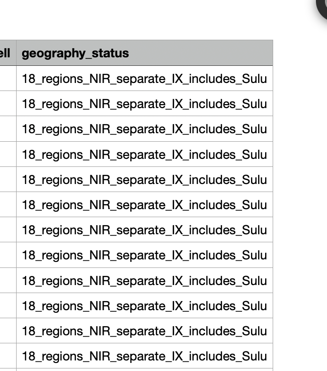

# Journal - 2026-10-07 - Verification Scope for Reusable Ingestion Code

## Today in one sentence

I learned that saying code is “verified” is only useful when I also state exactly which function, data revision, environment, and failure conditions were actually tested.

## What I learned

- Today the reusable Bronze ingestion work was merged into `dev` through [PR #18](https://github.com/ItsYangCoder/ph-government-budget-analysis/pull/18), but the more important learning was about **verification scope**. The main Bronze notebook had already demonstrated idempotent loading, yet the separate `databricks/load_bronze.py` helper originally still had an explicit note saying it had not been independently verified in Databricks.
- That distinction matters because two pieces of code can implement similar logic without sharing the same execution path. Testing a notebook that contains its own loading code does not automatically test a helper module that another notebook or job will import. The safest approach was to call the real `ingest_revision` helper from a dedicated verification notebook instead of copying its logic into a second test.
- The helper verification used one committed revision: `regional_2024/regional_cells`. The first run loaded **840 source rows** and reported **840 candidate new rows** with `verified: True`. The identical rerun reported **zero candidate new rows** and remained verified. This is good evidence that the helper preserved the selected revision and behaved idempotently for that exact test.
- I also learned to preserve the boundary of that claim. The evidence covers one table, one processing revision, one Databricks environment, and a single writer. It does not yet prove that every package behaves the same way or that two remote writers cannot race each other.
- The unsafe-symlink test added a different kind of boundary check. A **symbolic link**, or symlink, is a filesystem entry that points to another location. If ingestion follows a link outside the authorized input folder, it could read a file that was never intended to be part of the batch.
- The new test creates one unsafe link that points outside the input root and one valid workbook inside it. The expected behavior is intentionally mixed:
  - the unsafe file is recorded as `FAILED`;
  - its error explains that the path is outside the authorized input root;
  - no processing key is created for that unsafe input;
  - the valid workbook still finishes as `PROCESSED` with four fixture rows;
  - the audit report preserves both results.
- This is **failure isolation**. One bad input should not be silently accepted, but it also should not hide the result of an independent valid input. The run summary must make the partial failure obvious so nobody mistakes “some files processed” for “the whole batch passed.”
- The merge into `dev` is also a useful Git lesson. The feature branch contained the implementation and verification history, while the merge commit records the reviewed integration point. I should link the merge or PR when I claim the feature reached `dev`, and link the smaller commits when I explain how a specific behavior was proven.

## Terms I am still learning

- **Verification scope** — the exact code path, dataset, environment, conditions, and expected result covered by evidence.
- **Shared helper** — reusable code called by notebooks or jobs so the same logic is not copied into several places.
- **Symbolic link (symlink)** — a filesystem reference that redirects one path to another path.
- **Authorized input root** — the directory boundary from which the pipeline is allowed to read source files.
- **Failure isolation** — containing one input failure so other independent inputs can still be processed and reported correctly.
- **Single writer** — an execution assumption that only one process is modifying the target at a time.
- **Revision semantics** — the rules that decide how a new or corrected source revision should coexist with earlier data.

## What confused me

- At first, “the Bronze loader passed in Databricks” sounded broad enough. The code review made the gap clearer: the notebook path and the reusable helper path were separate claims until the helper itself was executed.
- The helper is verified for one regional table, but I still need to understand how much extra testing is necessary before calling it verified for all 21 Bronze tables. Schema variety, package size, and parser output may expose cases that one table does not.
- The current test assumes one writer. I still have an open question about the correct Delta strategy when two jobs try to ingest the same revision at nearly the same time.
- For Silver, I also need an explicit rule for revised source data: keep both revisions, select the latest approved revision, or rebuild a current snapshot without losing history.

## One small next step

- [ ] Add a focused automated test for `ingest_revision` that proves an identical rerun inserts zero rows and that a changed processing revision remains distinguishable from the earlier revision.

## Git checkpoint

- [x] I created or updated a file
- [x] I wrote a commit
- [x] I pushed my changes

## Decisions or assumptions (optional)

- I will not treat a similar notebook result as proof that a separate shared helper was tested.
- I will describe the verified helper result narrowly: `regional_2024/regional_cells`, 840 rows on the first run, zero candidate new rows on the identical rerun, and one writer.
- I will reject symlinks that resolve outside the authorized input root and record them as auditable per-file failures.
- I will allow independent valid files to continue, but the run summary must still show the failed count clearly.
- I will say the Bronze feature reached `dev` because PR #18 was merged; I will not claim that it reached `main`.

## Evidence from today (optional)

This previously inspected repository image represents the same engineering habit used in today's work: make assumptions and verification boundaries explicit instead of hiding them. Today's exact helper and symlink results are supported by the linked commits and merged PR.

- [Merged PR #18 — reusable Bronze ingestion pipeline](https://github.com/ItsYangCoder/ph-government-budget-analysis/pull/18)
- [Commit verifying the shared Bronze helper in Databricks](https://github.com/ItsYangCoder/ph-government-budget-analysis/commit/dcbe09edbcf1a364966d99523f4be991377290bf)
- [Commit testing unsafe symlink failure and valid-file continuation](https://github.com/ItsYangCoder/ph-government-budget-analysis/commit/71c5d41cb34de012d5a0ab664cbda1c28a3eac15)
- [Merge commit on `dev`](https://github.com/ItsYangCoder/ph-government-budget-analysis/commit/9cd31640d7efb11a109feea5da12cda96a0a9ae3)

## Reflection (optional)

- The useful lesson for me is that honest limitations make technical evidence stronger. “Verified for one revision with one writer” is more trustworthy than a broad claim that the helper simply works everywhere.
- Reusing the actual helper reduced the risk of testing a duplicate implementation while production code followed a different path.
- I want to carry this habit into profiling and Silver work: define the boundary first, test the real code path, and document what the result still does not prove.

## Mood or meme (optional)

- A green check is evidence, not unlimited permission to generalize. ✅
