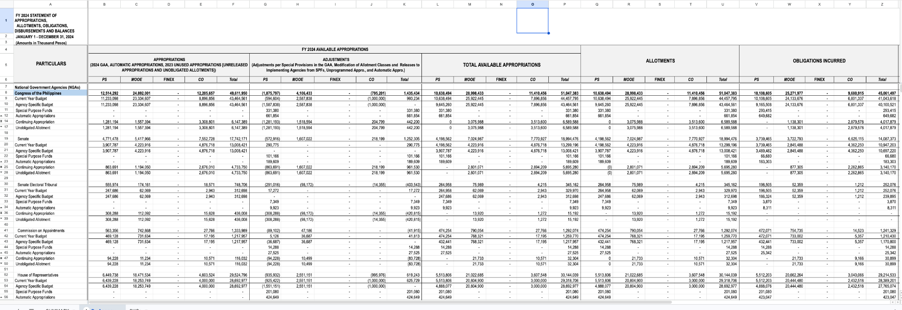

# Journal - 2026-10-08 - Wide-to-Long Needs Hierarchy, Not Just More Rows

## Today in one sentence

I learned that flattening a wide government budget worksheet is not only an unpivot problem; I also have to preserve the row hierarchy and rebuild the meaning hidden across several header rows.

## What I learned

- Today I went back to the FY2024 Statement of Appropriations, Allotments, Obligations, Disbursements and Balances workbook and focused on how to convert it into an analysis-ready CSV. I had removed the earlier flattened files so I could restart with a clearer rule for identifying which department or agency each record belongs to.
- The source is wide because one business measure is spread across many columns. The visible headings are also hierarchical. A column is not simply `MOOE`; its complete meaning may be `obligations incurred / MOOE` or `allotments / MOOE`. If I keep only the lowest header row, two different measures can receive the same name.
- A reliable column identity should therefore be built from all relevant header levels. For this sheet, that means keeping the major measure group, the optional subgroup, and the expense class:
  - major measure: appropriations, adjustments, total available appropriations, allotments, obligations, or disbursements;
  - expense class: personnel services (`PS`), maintenance and other operating expenses (`MOOE`), financial expenses (`FINEX`), capital outlays (`CO`), or total;
  - unit: thousand pesos for monetary values, while obligation rates are percentages.
- I need the same care on the row side. Labels such as a department, an attached agency, a budget class, and a subtotal do not all describe the same grain. A **grain** is what one row represents. Before unpivoting, I should classify source rows and carry the correct parent context into detail rows instead of treating every nonblank label as an ordinary agency.
- Forward-filling a parent label can help, but it is not automatically correct. It should only happen after I identify which rows are true hierarchy headers. Forward-filling a subtotal, a budget category such as “Current Year Budget,” or an unrelated section label would attach the wrong department to later records.
- A useful long-form record for this workbook would keep fields such as `fiscal_year`, `source_sheet`, `department`, `agency`, `row_type`, `measure_name`, `expense_class`, `measure_value`, `unit`, `source_row`, and `source_column`. The source coordinates are small but important because they let me trace a surprising value back to the exact cell that produced it.
- I also learned that “long” does not automatically mean “safe to aggregate.” Peso amounts can usually be summed within a compatible grain, but rates are non-additive. For example, an obligation rate should be recomputed from total obligations divided by total allotments rather than summed or averaged without a weighting rule.
- The transformation needs reconciliation checks. At minimum, I should compare selected source totals with totals reconstructed from the long table, verify that every numeric source cell maps to the expected measure and unit, and confirm that each detail record has the correct department or agency context.
- This work belongs between raw preservation and analytical modeling. The untouched workbook or Bronze representation should remain available for audit, while the normalized table can become a cleaner Silver-style contract. That separation lets me improve the parser without rewriting history or losing the original layout.

## Terms I am still learning

- **Wide format** — a table where many measures or periods are stored in separate columns.
- **Long format** — a table where repeated measurements are stored as rows, usually with a measure name and value.
- **Unpivot** — the operation that turns several value columns into repeated rows.
- **Grain** — the exact real-world meaning represented by one row.
- **Hierarchical header** — a header spread across multiple rows where each level contributes part of a column's meaning.
- **Lineage** — information that shows where a transformed record came from.
- **Control total** — a known source total used to check that a transformation did not lose, duplicate, or misclassify values.
- **Non-additive measure** — a value such as a rate that should not be summed across groups.

## What confused me

- The hardest part is that the worksheet communicates structure visually through merged cells, indentation, blank spaces, and subtotal rows. Those signals are obvious to a person looking at the sheet but are not reliable database keys by themselves.
- I am still working out the safest rule for distinguishing a department header from an agency row when both appear in the same label column. I do not want to solve that with a broad forward-fill that produces plausible-looking but incorrect lineage.
- The multi-row column headers also need a deterministic mapping. I need to decide whether to store `measure_name` and `expense_class` as separate fields or combine them into one generated column name for the downloadable CSV. Separate fields are better for filtering, while a combined name can be easier to inspect.
- I also need to keep the restart honest: the screenshots and discussion prove that I examined the workbook structure and planned the normalization rules, but there is no new GitHub commit in the PondoLens repository today that proves the full conversion was implemented.

## One small next step

- [ ] Normalize one small section of the FY2024 agency sheet into `department`, `agency`, `row_type`, `measure_name`, `expense_class`, `measure_value`, `unit`, `source_row`, and `source_column`, then reconcile its totals against the source worksheet.

## Git checkpoint

- [x] I created or updated a file
- [x] I wrote a commit
- [x] I pushed my changes

## Decisions or assumptions (optional)

- I will preserve the original workbook or Bronze representation and treat the long-form output as a separate normalized layer.
- I will reconstruct column meaning from every relevant header level instead of using only the bottom header row.
- I will classify hierarchy and subtotal rows before forward-filling parent labels.
- I will keep currency values and percentage rates distinguishable through an explicit `unit` field.
- I will retain source row and column coordinates so transformed values remain traceable.
- I will use a notebook for interactive discovery, then move stable transformation logic into version-controlled Python once the mapping rules are proven.

## Evidence from today (optional)

This screenshot from the workbook I reviewed shows why the transformation needs more than a basic melt: the meaning of each numeric cell depends on both the row label hierarchy and several levels of column headers. The image was checked before use and does not expose credentials, private URLs, local paths, or personal account details.

- [PondoLens source-ingestion branch](https://github.com/ItsYangCoder/ph-government-budget-analysis/tree/feat/source-ingestion)
- [Budget source configuration](https://github.com/ItsYangCoder/ph-government-budget-analysis/blob/feat/source-ingestion/configs/budget_sources.json)
- [Extended journal template used for this entry](https://github.com/ItsYangCoder/ftw-b12-journal/blob/main/templates/entry-extended.md)

## Reflection (optional)

- Restarting the flattening work made the missing requirement clearer: department lineage is part of the data, not decoration around the numbers.
- The source is difficult because its layout was designed for people to read, not for machines to normalize. That does not make the structure unusable; it means I need explicit parsing rules and reconciliation evidence.
- The main habit I want to keep is to separate “the output looks tabular” from “the output preserves business meaning.” A CSV can be syntactically clean and still be analytically wrong.

## Mood or meme (optional)

- More rows are not more truth unless every row still knows where it came from. 🧭
