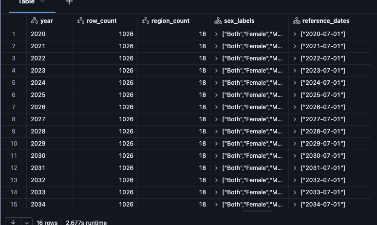

# Journal - 2026-10-09 - A Region Count Needs a Geography Version

## Today in one sentence

I learned that a count of 18 distinct `region_name` values is not enough to prove that I have 18 comparable regions; I must separate the national record, inspect the actual labels, and verify which geographic boundaries each dataset uses.

## What I learned

- Today I profiled `pondolens.dev_bronze.population`, which contains **16,416 rows** covering 2020–2035. One row represents a geographic label × year/reference date × age group × sex. The yearly profile returned **1,026 rows** and **18 distinct geographic labels** for each year.
- The word “region” in a column name can be misleading. The population table includes `PHILIPPINES` as a national total in the same `region_name` field as subnational areas. Therefore, `COUNT(DISTINCT region_name) = 18` answers “How many labels are stored?” It does not automatically answer “How many regional denominators are available?”
- The row count provides a useful structural check. The observed 1,026 records per year are consistent with 18 geographic labels × 19 age-group labels × 3 sex labels. This confirms that totals and components are deliberately stored together, so I must filter the grain before using population as a denominator.
- For a regional per-person calculation, the candidate grain is:
  - `age_group = 'Total'`;
  - `sex = 'Both'`;
  - `region_name <> 'PHILIPPINES'`;
  - the same year and compatible regional boundary as the spending measure.
- The current official Philippine Standard Geographic Code lists **18 regions**, including the Negros Island Region (NIR). PSA reported that NIR was established under Republic Act No. 12000 on June 11, 2024. That does not mean an older population-projection table was automatically rewritten to the new geography.
- This creates a **boundary-version problem**. If the population source contains 17 subnational regions plus `PHILIPPINES`, while GRDP or spending uses the newer 18-region structure with NIR, a name-based join will leave a gap or compare areas that no longer have the same coverage.
- I should not manufacture an NIR population by simply subtracting or splitting regional totals unless the source provides province-level values and a defensible mapping. NIR contains areas that were previously grouped under Western Visayas and Central Visayas. A region-level source alone may not contain enough detail to recast those boundaries accurately.
- A better Silver design needs explicit geography metadata, such as `geographic_level`, `region_code`, `boundary_version`, `valid_from`, and `valid_to`. A crosswalk should document whether a source uses pre-NIR or post-NIR boundaries instead of silently forcing labels to match.
- The notebook's reconciliation checks also showed why small differences need interpretation. Reported national totals and the sum of regional totals differ in 9 of 16 years, with a maximum absolute difference of 200 persons. Age-group sums and sex components also have small differences. These are findings to preserve and investigate, not values to overwrite just to make totals agree.
- I also clarified the difference between a **semantic note** and a **conclusion**. A semantic note defines how a field or metric should be interpreted, such as “population means projected persons as of July 1” or “spending per person is not cash received by each resident.” A conclusion states whether the data is ready, what must change in Silver, and which questions remain open.
- The repository now has team profiling notebooks on `main`, plus CI checks for Python and notebook structure. The CI update also learned to recognize Databricks magic commands such as `%sql` instead of trying to parse SQL cells as Python. This is useful because repository validation proves that the notebook is structurally valid, while the Databricks result screenshot proves that a specific query actually ran.

## Terms I am still learning

- **Geographic label** — a stored place name; it may represent a country, region, province, or another level.
- **Geographic grain** — the exact geographic level represented by one record.
- **Boundary version** — the official geographic structure that was valid when a dataset was produced.
- **Crosswalk** — a mapping that explains how geographic codes or names relate across datasets or boundary versions.
- **Denominator** — the value used as the base of a rate, such as population in spending per person.
- **Semantic note** — a rule that explains what a field or metric means and how it should be interpreted.
- **Reconciliation** — comparing totals and components to identify differences without silently changing source values.
- **Notebook magic** — a Databricks or Jupyter command such as `%sql` that changes how a notebook cell is executed.

## What confused me

- Seeing `region_count = 18` initially looked like confirmation that all 18 current Philippine regions were present. The confusion came from using the field name as the definition. The query counted distinct values in `region_name`, and one of those values can be the national `PHILIPPINES` record.
- The Philippines currently has 18 official regions, but the population projection covers 2020–2035 and may retain a boundary structure established before NIR was restored. I still need to confirm the projection workbook's exact geographic basis instead of assuming that a current official count applies to every historical or projected dataset.
- I am not yet sure which comparison basis the team should adopt for Q3: use a common pre-NIR geography, find a post-NIR population source, or recast datasets from lower-level geography when the required detail exists.
- The national-versus-regional differences are small, but the source note I found explains age-group rounding only. It does not yet fully explain every sex or national/regional difference, so those checks should stay open.

## One small next step

- [ ] Build a 2024–2025 geography compatibility table that lists every population, GRDP, and regional-spending label; classifies national versus regional records; flags NIR coverage; and records the boundary version before approving any per-person join.

## Git checkpoint

- [x] I created or updated a file
- [x] I wrote a commit
- [x] I pushed my changes

## Decisions or assumptions (optional)

- I will rename the profiling output from `region_count` to `geographic_label_count` so the column does not overstate what was counted.
- I will exclude `PHILIPPINES` when selecting regional denominators, but keep it as a separate national control total.
- I will not treat matching place names as proof of matching geographic boundaries.
- I will preserve source totals and add reconciliation flags instead of adjusting values to force equality.
- I will not approve population as a Q3 denominator until its regional boundary is compatible with the spending and GRDP sources.
- I will keep semantic notes separate from the conclusion: meaning first, readiness decision second.

## Evidence from today (optional)

This inspected screenshot shows the result that triggered today's learning. It verifies 1,026 records and 18 distinct stored labels per year, but it does not by itself classify those labels as national or regional. The image contains no credentials, private URLs, account names, or local file paths.

- [Population profiling notebook on PondoLens `main`](https://github.com/ItsYangCoder/ph-government-budget-analysis/blob/main/databricks/notebook/profiling/rhea_population_profiling.ipynb)
- [Commit adding the profiling notebooks and simplified Bronze ingestion](https://github.com/ItsYangCoder/ph-government-budget-analysis/commit/ce800862f84b7fb8f4d6a3af0a4c40e59b1f2e11)
- [Commit adding Python and notebook CI checks](https://github.com/ItsYangCoder/ph-government-budget-analysis/commit/35144871c877fa705d1b8c2ac99c5087ccbc4a9c)
- [Commit teaching CI to handle Databricks notebook magic commands](https://github.com/ItsYangCoder/ph-government-budget-analysis/commit/281f0e86b3f52ddcba36e43377703fb0dedbd286)
- [PSA Philippine Standard Geographic Code — 18 current regions](https://psa.gov.ph/classification/psgc/regions)
- [PSA notice on the creation of the Negros Island Region](https://psa.gov.ph/content/second-quarter-2024-psgc-updates-creation-negros-island-region-and-correction-names-two)
- [PSA population-projection statistics and technical sources](https://psa.gov.ph/statistics/census/projected-population)

## Reflection (optional)

- The important correction today was not changing 17 to 18 in a sentence. It was learning to ask what the query actually counted and which geography the source represents.
- A result can be numerically correct and still be semantically misleading when the alias, grain, or boundary version is unclear.
- This made the purpose of profiling more concrete for me. Profiling is not only checking nulls and duplicates; it is also discovering whether two valid datasets describe the same world in the same way.
- I want the Silver layer to make this uncertainty visible instead of hiding it behind a successful join.

## Mood or meme (optional)

- `COUNT(DISTINCT region_name) = 18` — okay, but 18 *what*? 🗺️
